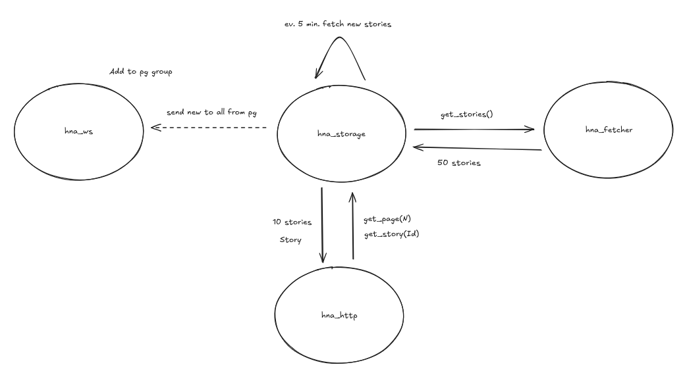

# hacker_news_aggregator

An OTP project implementing an aggregator of hacker news stories.
Main features:
- Fetch top 50 stories via [hacker news API](https://github.com/HackerNews/API).
- Refresh stories every 5 minutes.
- Expose HTTP/WebSocket endpoints to access the data.

## API

### HTTP

Default port: 8080

Pages
```
GET /page/<page nr>
```

Stories
```
GET /story/<story id>
```

### WebSocket

Default port: 8081

Start connection on path:
```
/
```

## Modules

The app contains few modules which are described here.

### hna_storage

Main project module. It's implemented as a gen_server, storing stories as its state. Periodically calls hna_fetcher to refresh saved stories. It does so in a separate process so that the gen_server process isn't blocked by network IO. Its interface consists of functions acessing the stored stories.

### hna_fetcher

This module implements only a single functionality. It exports get_stories/0 function that fetches stories from Hacker News and returns them as a list. It is used by hna_storage to refresh its data.

### hna_http

Implements REST API described above.

### hna_ws

Implements websocket handler described above. Each websocket connection in cowboy is a separate process. Here these processes are added to a pg group "ws_connections". Thanks to that we can keep track of all connections and send them stories updates without any manual subscription mechanism.

Interactions between modules can be seen on this graph





## Build

    $ rebar3 compile

## Run
Test with:

    $ rebar3 shell

Run release with:

    $ rebar3 release
    $ ./_build/default/rel/hacker_news_aggregator/bin/hacker_news_aggregator console

